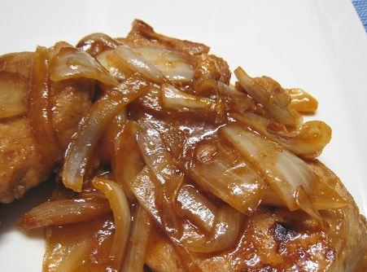

A fast cooking for mwk to bring meal to work (4 serving)

Ingredients 
===========
pork chop - 400g

sugar - 2 tsp

starch - 1 tsp

onion - 1 pieces (chopped into slices)

soy sauce - 2 tsp

cooking alcohol - 1 tsp

Seasonings
===========
salt - 1/2 tsp

black pepper - 1/4 tsp

Preparation
===========

1. Wash pork chop and punch through both side to loosen the pork chop. 
2. Marinate soy sauce, cooking alcohol, sugar and starch for 20 mintues. 
3. Peel onion, chop into slices. 
4. Heat up the oil, fry both pork chops both sides until brown.
5. Add oil, fry the onion and add more soy sauce, sugar, and some water. 
6. Mix onion and pork chop together and serve. 
7. Feast!

===========
