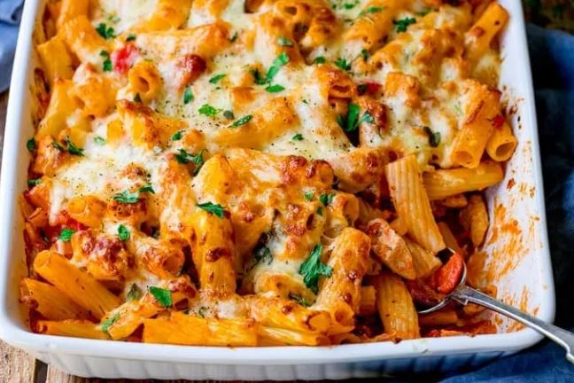

A fast cooking for mwk to bring meal to work (6 serving)

Ingredients 
===========
dried pasta (penne) - 400g

chicken breasts/thighs - 300g

large onion - 1 pieces

garlic - 2 cloves

fresh cherry tomato - 10 pieces

chopped tomatoes/sauce - 800g

double cream/cooking cream - 120 ml

bacons - 6 rash

mozzarella - 100g

cheddar - 100g

Seasonings
===========
salt - 1 tsp

black pepper - 1 tsp

oregano

parsley

Preparation
===========

1. peel and chop onion and garlic into small pieces
2. chop cherry tomato
3. boil and cook pasta for 1 min, then drain
4. heat the pan with oil in a large frying pan, cook bacon and reserve it
5. add chicken and cook with lid for 5 mins
6. add onion and cook for further 3-4 mins until onion is softened
7. add chopped tomatoes, pepper, salt, garlic, oregano
8. stir and cook for 2-3 mins
9. stir in the tomato sauce with cream until gentle bubble
10. add pasta, bacon, and stir everything together
11. top with cheddar and mozzarella, place in oven for 20-25 mins until cheese is golden
12. Feast!

===========
