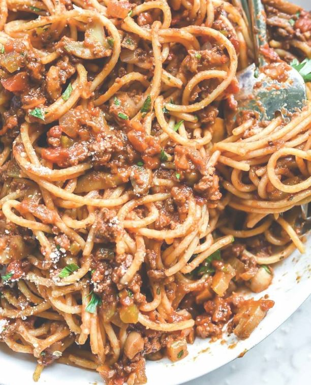

A fast cooking for mwk to bring meal to work (6 serving)

Ingredients 
===========
Ground beef mince - 500g

Spagetti - 340g

olive oil - 3 tbsp

butter - 2 tbsp

onion - 1 pieces

garlic - 3 clove

tomato paste - 2 tbsp

dried oregano - 1/2 tsp

broth (or red wine) - 1 cup

crushed tomatoes - 1 can

shredded parmesan cheese - 1/2 cup

Seasonings
===========
salt - 1/2 tsp

black pepper - 1/4 tsp

Preparation
===========

1. Heat the oil in a large pot over medium-high heat
2. Add meat and cook until brown (8 mins)
3. Use wooden spoon to break it up into smaller crumbles
4. Add onion and stirring until softened
5. Stir in garlic, tomato paste and oregano
6. Pour in water and put in can tomato, salt and pepper
7. Bring the sauce to a low simmer (25 mins uncovered)
8. About 15 mins before sauce finish, boil salt water
9. Cook the spagetti according to the instruction at the bacl
10. Stir sour cream to temper and constantly stirring
11. Serve spagetti with sauce plus paremesan sprinkled on top
12. Feast!

===========
