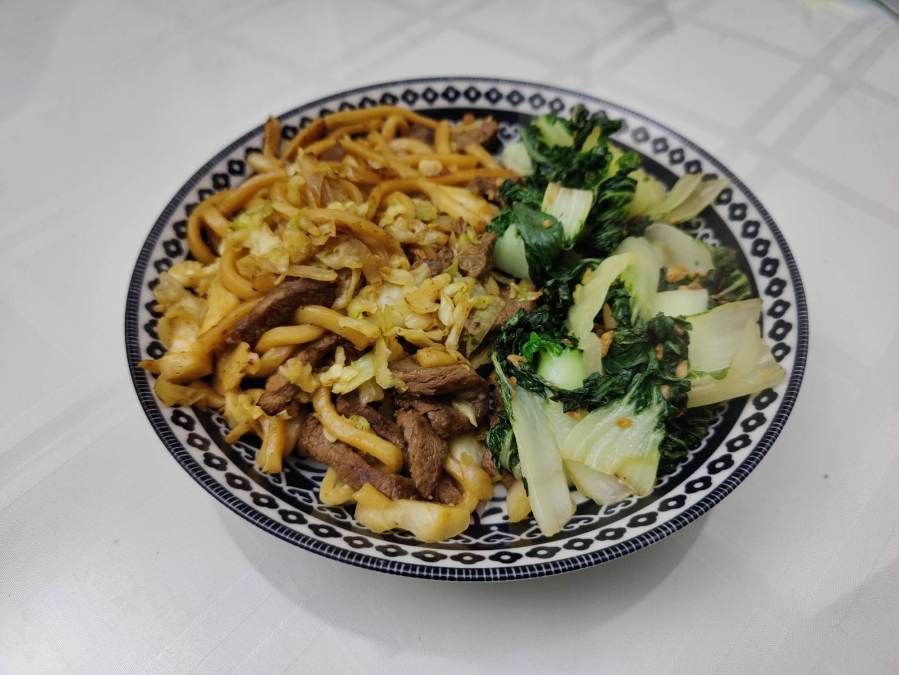

A fast cooking for mwk to bring meal to work (1 serving)

Ingredients 
===========
Onion - 1 piece

Spring onion - 1 stalk

Garlic (minced) - 1 spns

beef stripes - 400g

frozen udon - 2 packs

Seasonings
===========
white pepper

sugar

black pepper

soy sauce - 2 tbl spns

Preparation
===========

1. Slice onions to stripe
2. Cut spring onion into small pieces
3. Cut beef into stripes and marinate them
4. Put frozen udon into boiling water for 3-4 mintues, then remove water
5. Heat the pan with 1 tbs of oils, put in garlic and oninon with medium heat 
6. Cook the stripe beef with medium-heat
6. Put in the udon with chopsticks 
7. Mix soy sauce and sugar together and dye the udon in 3 seperate time 
8. Mix beef with udon
9. Feast!

===========

