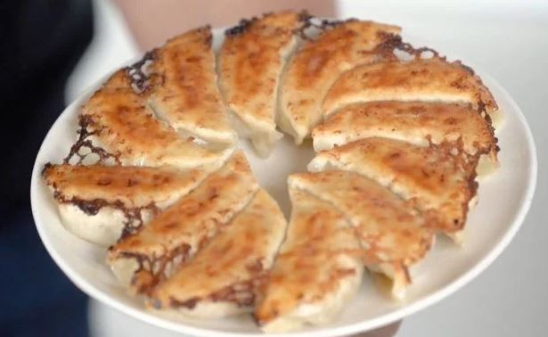

A fast cooking for mwk to bring meal to work (1 serving)

Ingredients 
===========
frozen dumplings - 1 packs

Seasonings
===========

oils - 2 tbs

Preparation
===========

1. Preheat the panwith medium heat
2. Wait until it is completely heated
3. Add 1.5 tbs of oil into the pan while power is off
4. Put frozen dumplings onto the pan
5. Add 100ml hot water with 21cm pan, 150ml hot water with 24cm pan
6. Cover the pan with lid with medium-heat for 5 mins
6. Open lid to cook the dumplings until golden is on the edge
7. Close the fire and serve the dumplings upside down pan with the plate on top 
8. Feast!

===========

