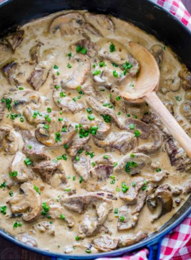

A fast cooking for mwk to bring meal to work (4 serving)

Ingredients 
===========
top sirloin steak - 500g
olive oil - 2 tbsp
butter - 2 tbsp
onion - 0.5 pieces
garlic - 1 clove
all purpose flour - 1 tbsp
beef broth - 1 cup
heavy whipping cream - 3/4 cup
sour cream - 1/4 cup
dijon mustard - 1/2 tsp
Worcestershire sauce - 1 tbsp
salt - 1/2 tsp
black pepper - 1/4 tsp

Seasonings
===========
beef broth - 240 ml
heavy whipping cream - 180 ml
sour cream - 60 ml
dijon mustard - 1/2 tsp
Worcestershire sauce - 1 tbsp
salt - 1/2 tsp
black pepper - 1/4 tsp

Preparation
===========

1. Place a large deep pan over medium-high heat
2. Add 2 tbsp oil
3. Once oil is very hot, add thinly sliced beef strips, cook 1 mins
4. Remove beef when it just turn brown
5. Add butter, chopped onion, slice muschrooms
6. Sautee 6-8 mins until onion and mushrooms are soft and brown
7. Add minced garlic clove and sautee 1 min
8. Add flour and sautee 1 min
9. Pour 1 cup beef broth, add cream and simmer for 2 mins until thicken
10. Stir sour cream to temper and constantly stirring
11. Stir in worcestershire, mustard, salt and pepper until sauce is creamy
12. Add beef with all juices back to the pan to heat up beef
13. Feast!

===========

