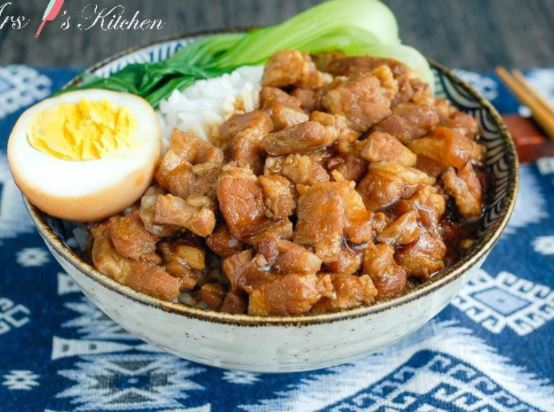

A yummy cooking for mwk to bring meal to work (4 serving)

Ingredients 
===========
五花腩 - 500g

Black Sugar - 2 tbsp

生抽 - 100ml

老抽 - 1 tbsp

water - 500ml

sake - 2 tbsp

Egg - 2 pcs

Seasonings
===========
salt - 1/2 tsp

八角 - 1 tsp

花椒 - 1 tsp

Preparation
===========

1. 將帶皮五花腩切條狀，燒熱鑊後下油，炒五花肉數分鐘，再下蒜蓉
2. 豬皮要一起滷，要間歇性滷，關火1小時候，再度開火，中火煮滾
3. 小火燉10分鐘後關火悶著。重複三次。(鑄鐵鍋才能做到)
4. 隔壁爐起鍋，冷鍋入沖繩黑糖+一點點水，煮焦糖
5. 冷鍋將黑糖還有一點開水，小火慢慢煮，比較不會噴的到處都是，等黑糖融掉後，就可以淋在豬肉上
6. 拌炒均勻。每塊肉閃閃發亮
7. 入一些清酒，適量就好，要大火一點，將酒精燒掉。大概燒3分鐘左右
8. 等酒精燒的差不多時候，裝入比醬油多4倍的水
9. 中火煮約3分鐘，蓋上蓋子，小火燉煮30分鐘後，關火
10. 悶上4小時左右 (一天更好)
11. 開蓋，再度開火，收一點汁，讓醬汁濃稠一點，大約是原來的一半
12. Feast!

===========
