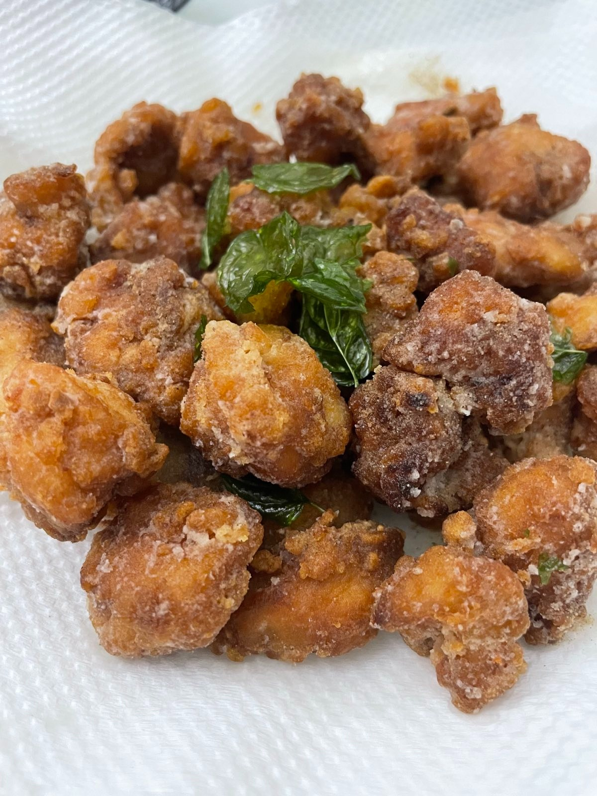

A yummy cooking for mwk to bring meal to work (2 serving)

Ingredients 
===========
雞柳 - 330g

生抽 - 1 tbsp

garlic - 4 cloves (minced)

sugar - 0.5 teasp

木薯粉 - 80g

Cooking Oil - 800ml

Seasonings
===========
Basil

White pepper

Preparation
===========

1. 雞柳解凍洗淨用廚房紙印乾，切件，每件約 2隻手指闊。
2. 每件雞柳輕力界兩刀，方便炸熟和更入味。
3. 加入醬油膏丶蒜蓉和砂糖拌勻，醃30分鐘。
4. 木薯粉或蕃薯粉放碟上，醃好的雞肉，兩邊均勻沾上粉料，不用太厚，放置約5分鐘就可以。
5. 油鑊預熱中火 160°C
6. 羅勒洗亁淨抺超乾，不洗可直接放油鍋內炸， 20秒左右可以撈起。
7. 到中火時雞件逐件放入，不要放太多，避免油溫一次過降得太低，也不要黏在一起。
8. 第一次炸 2分鐘，瀝起休息 2分鐘，翻炸 1分鐘至金黃色。
9. 炸好後撒上胡椒鹽或味椒鹽，拋幾下至均勻即成。
10. Feast!

===========
